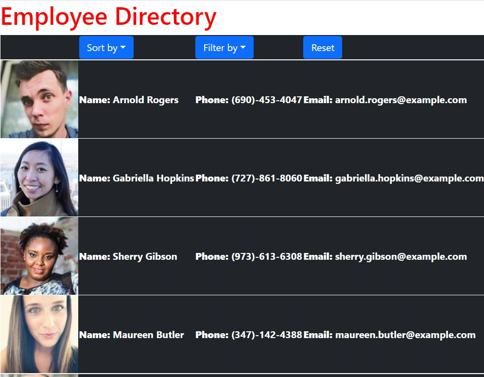

# Employee-Directory

## Table of Contents

- [Description](#description)
- [Technologies](#technologies)
- [Links](#links)

## Description

This application is an employee directory for daily use built with React. The application loads 10 employees randomly from a random user API. The functionality this application has is to be able to sort alphabetically through the employees by last name and filter the employees in the list by gender (m/f).

**Visuals**:  This image shows the example of the employee app in use.

## Technologies

- React
- Javascript
- HTML
- CSS
- JQuery

## Links

- [Live on Heroku](https://murmuring-fortress-39561.herokuapp.com/)
